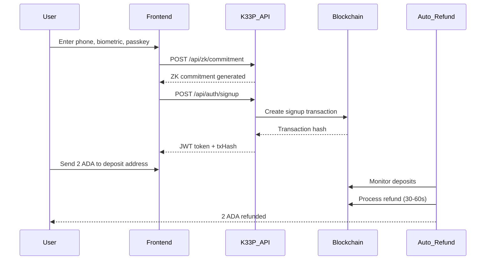
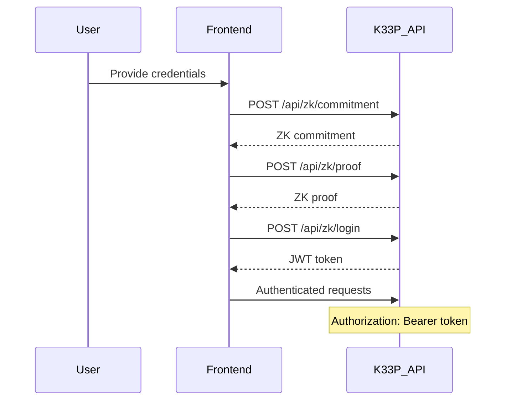
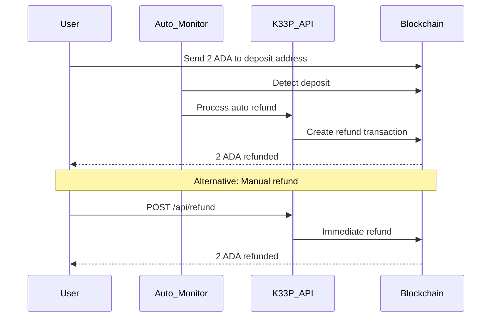
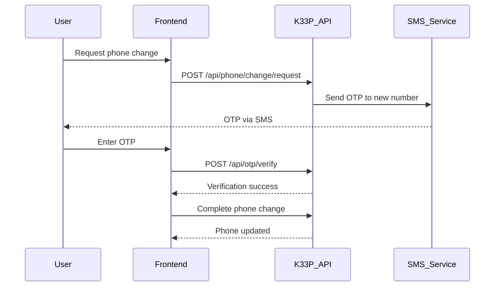

# K33P Backend - Complete API Documentation

## Table of Contents

1. [Overview](#overview)
2. [Base URLs](#base-urls)
3. [Authentication](#authentication)
4. [System Endpoints](#system-endpoints)
5. [Authentication Routes](#authentication-routes)
6. [Zero-Knowledge Proof Routes](#zero-knowledge-proof-routes)
7. [UTXO Management Routes](#utxo-management-routes)
8. [User Management Routes](#user-management-routes)
9. [Phone Management Routes](#phone-management-routes)
10. [Account Recovery Routes](#account-recovery-routes)
11. [OTP Routes](#otp-routes)
12. [Refund System](#refund-system)
13. [Admin Routes](#admin-routes)
14. [Complete User Flow](#complete-user-flow)
15. [Error Codes](#error-codes)

---

## Overview

The K33P Backend is a comprehensive identity management system built on Cardano blockchain with Zero-Knowledge Proof authentication, biometric verification, and automatic 2 ADA refund processing.

**Key Features:**
- Zero-Knowledge Proof authentication
- Biometric verification
- Phone-based OTP authentication
- Automatic 2 ADA refund system
- UTXO management
- Account recovery mechanisms
- Admin monitoring tools

---

## Base URLs

**Production:** `https://k33p-backend-0kyx.onrender.com`
**Development:** `http://localhost:3000`

---

## Authentication

### JWT Token Authentication
Most endpoints require JWT authentication. Include the token in the Authorization header:

```bash
Authorization: Bearer your_jwt_token_here
```

### Admin API Key
Admin endpoints require an API key:

```bash
X-API-KEY: k33p_admin_api_key_12345
```

---

## System Endpoints

### 1. Health Check

**Endpoint:** `GET /api/health`
**Description:** Check system health status
**Authentication:** None

**cURL Request:**
```bash
curl -X GET "https://k33p-backend-0kyx.onrender.com/api/health" \
  -H "Content-Type: application/json"
```

**Response (200):**
```json
{
  "success": true,
  "message": "System is healthy",
  "data": {
    "status": "healthy",
    "timestamp": "2024-01-25T10:00:00Z",
    "version": "1.0.0",
    "uptime": 86400
  }
}
```

### 2. System Status

**Endpoint:** `GET /api/status`
**Description:** Get system statistics and status
**Authentication:** None

**cURL Request:**
```bash
curl -X GET "https://k33p-backend-0kyx.onrender.com/api/status" \
  -H "Content-Type: application/json"
```

**Response (200):**
```json
{
  "success": true,
  "message": "System status retrieved",
  "data": {
    "totalUsers": 1250,
    "totalSeedPhrases": 3420,
    "systemLoad": "normal",
    "maintenanceMode": false
  }
}
```

### 3. API Version

**Endpoint:** `GET /api/version`
**Description:** Get API version information
**Authentication:** None

**cURL Request:**
```bash
curl -X GET "https://k33p-backend-0kyx.onrender.com/api/version" \
  -H "Content-Type: application/json"
```

**Response (200):**
```json
{
  "success": true,
  "data": {
    "version": "1.0.0",
    "buildDate": "2024-01-25",
    "environment": "production"
  }
}
```

### 4. Deposit Address

**Endpoint:** `GET /api/deposit-address`
**Description:** Get the deposit address for 2 ADA deposits
**Authentication:** None

**cURL Request:**
```bash
curl -X GET "https://k33p-backend-0kyx.onrender.com/api/deposit-address" \
  -H "Content-Type: application/json"
```

**Response (200):**
```json
{
  "success": true,
  "data": {
    "address": "addr1qxy8ac7qqy0vtulyl7wntmsxc6wex80gvcyjy33qffrhm7sh927ysx5sftw0dlpzwjncxmfh780kdtp2f06lz0jy0lapmr5gwm",
    "network": "testnet",
    "amount": "2 ADA"
  },
  "message": "Deposit address retrieved successfully"
}
```

---

## Authentication Routes

### 1. User Signup

**Endpoint:** `POST /api/auth/signup`
**Description:** Register a new user with ZK proof generation
**Authentication:** None

**cURL Request:**
```bash
curl -X POST "https://k33p-backend-0kyx.onrender.com/api/auth/signup" \
  -H "Content-Type: application/json" \
  -d '{
    "walletAddress": "addr1qxy8ac7qqy0vtulyl7wntmsxc6wex80gvcyjy33qffrhm7sh927ysx5sftw0dlpzwjncxmfh780kdtp2f06lz0jy0lapmr5gwm",
    "phone": "+1234567890",
    "biometric": "biometric_hash_data",
    "passkey": "passkey_data"
  }'
```

**Response (201) - Success:**
```json
{
  "success": true,
  "message": "User registered successfully",
  "data": {
    "txHash": "abc123def456...",
    "token": "eyJhbGciOiJIUzI1NiIsInR5cCI6IkpXVCJ9...",
    "userId": "user_12345"
  },
  "timestamp": "2024-01-25T10:00:00Z"
}
```

**Response (400) - User Exists:**
```json
{
  "success": false,
  "error": "User already exists with this phone number",
  "timestamp": "2024-01-25T10:00:00Z"
}
```

---

## Zero-Knowledge Proof Routes

### 1. Generate ZK Commitment

**Endpoint:** `POST /api/zk/commitment`
**Description:** Generate a Zero-Knowledge commitment from user inputs
**Authentication:** None

**cURL Request:**
```bash
curl -X POST "https://k33p-backend-0kyx.onrender.com/api/zk/commitment" \
  -H "Content-Type: application/json" \
  -d '{
    "phone": "+12345675460",
    "biometric": "biometric_hash_data",
    "passkey": "passkey_data"
  }'
```

**Response (200):**
```json
{
  "success": true,
  "data": {
    "commitment": "zk_commitment_hash_abc123...",
    "hashes": {
      "phoneHash": "phone_hash_def456...",
      "biometricHash": "biometric_hash_ghi789...",
      "passkeyHash": "passkey_hash_jkl012..."
    }
  },
  "message": "ZK commitment generated successfully",
  "timestamp": "2024-01-25T10:00:00Z"
}
```

### 2. Generate ZK Proof

**Endpoint:** `POST /api/zk/proof`
**Description:** Generate a Zero-Knowledge proof
**Authentication:** None

**cURL Request:**
```bash
curl -X POST "https://k33p-backend-0kyx.onrender.com/api/zk/proof" \
  -H "Content-Type: application/json" \
  -d '{
    "phone": "+1234567890",
    "biometric": "biometric_data_hash",
    "passkey": "passkey_data",
    "commitment": "zk_commitment_hash_abc123..."
  }'
```

**Response (200):**
```json
{
  "success": true,
  "data": {
    "proof": {
      "publicInputs": {
        "commitment": "zk_commitment_hash_abc123..."
      },
      "isValid": true,
      "proofData": "proof_data_xyz789..."
    }
  },
  "message": "ZK proof generated successfully",
  "timestamp": "2024-01-25T10:00:00Z"
}
```

### 3. Verify ZK Proof

**Endpoint:** `POST /api/zk/verify`
**Description:** Verify a Zero-Knowledge proof
**Authentication:** None

**cURL Request:**
```bash
curl -X POST "https://k33p-backend-0kyx.onrender.com/api/zk/verify" \
  -H "Content-Type: application/json" \
  -d '{
    "proof": {
      "publicInputs": {
        "commitment": "zk_commitment_hash_abc123..."
      },
      "isValid": true,
      "proofData": "proof_data_xyz789..."
    },
    "commitment": "zk_commitment_hash_abc123..."
  }'
```

**Response (200):**
```json
{
  "success": true,
  "data": {
    "verified": true,
    "commitment": "zk_commitment_hash_abc123..."
  },
  "message": "ZK proof verified successfully",
  "timestamp": "2024-01-25T10:00:00Z"
}
```

### 4. ZK Login

**Endpoint:** `POST /api/zk/login`
**Description:** Login using Zero-Knowledge proof
**Authentication:** None

**cURL Request:**
```bash
curl -X POST "https://k33p-backend-0kyx.onrender.com/api/zk/login" \
  -H "Content-Type: application/json" \
  -d '{
    "proof": {
      "publicInputs": {
        "commitment": "zk_commitment_hash_abc123..."
      },
      "isValid": true,
      "proofData": "proof_data_xyz789..."
    },
    "commitment": "zk_commitment_hash_abc123..."
  }'
```

**Response (200):**
```json
{
  "success": true,
  "data": {
    "token": "eyJhbGciOiJIUzI1NiIsInR5cCI6IkpXVCJ9...",
    "userId": "user_12345",
    "expiresIn": "24h"
  },
  "message": "Login successful",
  "timestamp": "2024-01-25T10:00:00Z"
}
```

---

## UTXO Management Routes

### 1. Fetch UTXOs by Phone Hash

**Endpoint:** `GET /api/utxo/fetch/:phoneHash`
**Description:** Fetch UTXOs at script address by phone hash
**Authentication:** JWT Token Required

**cURL Request:**
```bash
curl -X GET "https://k33p-backend-0kyx.onrender.com/api/utxo/fetch/phone_hash_abc123" \
  -H "Content-Type: application/json" \
  -H "Authorization: Bearer your_jwt_token_here"
```

**Response (200):**
```json
{
  "success": true,
  "data": [
    {
      "txHash": "transaction_hash_abc123...",
      "outputIndex": 0,
      "amount": "2000000",
      "datum": {
        "phoneHash": "phone_hash_abc123...",
        "commitment": "zk_commitment_hash..."
      }
    }
  ],
  "message": "UTXOs retrieved successfully",
  "timestamp": "2024-01-25T10:00:00Z"
}
```

### 2. Issue UTXO Refund

**Endpoint:** `POST /api/utxo/refund`
**Description:** Issue a refund for a specific UTXO
**Authentication:** JWT Token Required

**cURL Request:**
```bash
curl -X POST "https://k33p-backend-0kyx.onrender.com/api/utxo/refund" \
  -H "Content-Type: application/json" \
  -H "Authorization: Bearer your_jwt_token_here" \
  -d '{
    "utxo": {
      "txHash": "transaction_hash_abc123...",
      "outputIndex": 0
    },
    "ownerAddress": "addr1qxy8ac7qqy0vtulyl7wntmsxc6wex80gvcyjy33qffrhm7sh927ysx5sftw0dlpzwjncxmfh780kdtp2f06lz0jy0lapmr5gwm",
    "zkProof": {
      "proof": "zk_proof_data",
      "publicInputs": {
        "commitment": "zk_commitment_hash"
      },
      "isValid": true
    }
  }'
```

**Response (200):**
```json
{
  "success": true,
  "data": {
    "txHash": "refund_transaction_hash_def456..."
  },
  "message": "Refund issued successfully",
  "timestamp": "2024-01-25T10:00:00Z"
}
```

### 3. Track New UTXO

**Endpoint:** `POST /api/utxo/track`
**Description:** Track a new UTXO in the database
**Authentication:** JWT Token Required

**cURL Request:**
```bash
curl -X POST "https://k33p-backend-0kyx.onrender.com/api/utxo/track" \
  -H "Content-Type: application/json" \
  -H "Authorization: Bearer your_jwt_token_here" \
  -d '{
    "txHash": "transaction_hash_abc123...",
    "outputIndex": 0,
    "amount": "2000000",
    "datum": {
      "phoneHash": "phone_hash_abc123...",
      "commitment": "zk_commitment_hash..."
    }
  }'
```

**Response (200):**
```json
{
  "success": true,
  "data": {
    "utxoId": "utxo_12345",
    "tracked": true
  },
  "message": "UTXO tracked successfully",
  "timestamp": "2024-01-25T10:00:00Z"
}
```

### 4. Get User UTXOs

**Endpoint:** `GET /api/utxo/user`
**Description:** Get all UTXOs for the current user
**Authentication:** JWT Token Required

**cURL Request:**
```bash
curl -X GET "https://k33p-backend-0kyx.onrender.com/api/utxo/user" \
  -H "Content-Type: application/json" \
  -H "Authorization: Bearer your_jwt_token_here"
```

**Response (200):**
```json
{
  "success": true,
  "data": {
    "utxos": [
      {
        "txHash": "transaction_hash_abc123...",
        "outputIndex": 0,
        "amount": "2000000",
        "status": "confirmed"
      }
    ],
    "totalAmount": "2000000",
    "count": 1
  },
  "message": "User UTXOs retrieved successfully",
  "timestamp": "2024-01-25T10:00:00Z"
}
```

### 5. Create UTXO Deposit

**Endpoint:** `POST /api/utxo/deposit`
**Description:** Create a new UTXO deposit
**Authentication:** JWT Token Required

**cURL Request:**
```bash
curl -X POST "https://k33p-backend-0kyx.onrender.com/api/utxo/deposit" \
  -H "Content-Type: application/json" \
  -H "Authorization: Bearer your_jwt_token_here" \
  -d '{
    "amount": 2,
    "walletAddress": "addr1qxy8ac7qqy0vtulyl7wntmsxc6wex80gvcyjy33qffrhm7sh927ysx5sftw0dlpzwjncxmfh780kdtp2f06lz0jy0lapmr5gwm"
  }'
```

**Response (200):**
```json
{
  "success": true,
  "data": {
    "txHash": "deposit_transaction_hash_ghi789...",
    "amount": "2000000",
    "depositAddress": "addr1qxy8ac7qqy0vtulyl7wntmsxc6wex80gvcyjy33qffrhm7sh927ysx5sftw0dlpzwjncxmfh780kdtp2f06lz0jy0lapmr5gwm"
  },
  "message": "Deposit created successfully",
  "timestamp": "2024-01-25T10:00:00Z"
}
```

### 6. Get User Balance

**Endpoint:** `GET /api/utxo/balance`
**Description:** Get the user's UTXO balance
**Authentication:** JWT Token Required

**cURL Request:**
```bash
curl -X GET "https://k33p-backend-0kyx.onrender.com/api/utxo/balance" \
  -H "Content-Type: application/json" \
  -H "Authorization: Bearer your_jwt_token_here"
```

**Response (200):**
```json
{
  "success": true,
  "data": {
    "balance": "2000000",
    "balanceADA": "2.0",
    "utxoCount": 1,
    "pendingRefunds": 0
  },
  "message": "Balance retrieved successfully",
  "timestamp": "2024-01-25T10:00:00Z"
}
```

---

## User Management Routes

### 1. Create User Profile

**Endpoint:** `POST /api/users`
**Description:** Create a new user profile
**Authentication:** None

**cURL Request:**
```bash
curl -X POST "https://k33p-backend-0kyx.onrender.com/api/users" \
  -H "Content-Type: application/json" \
  -d '{
    "userId": "user_12345",
    "email": "user@example.com",
    "username": "john_doe",
    "phoneNumber": "+1234567890",
    "userAddress": "addr1qxy8ac7qqy0vtulyl7wntmsxc6wex80gvcyjy33qffrhm7sh927ysx5sftw0dlpzwjncxmfh780kdtp2f06lz0jy0lapmr5gwm",
    "biometricType": "fingerprint",
    "verificationMethod": "phone",
    "pin": "1234"
  }'
```

**Response (201):**
```json
{
  "success": true,
  "message": "User profile created successfully",
  "user": {
    "id": "profile_12345",
    "userId": "user_12345",
    "email": "user@example.com",
    "username": "john_doe",
    "createdAt": "2024-01-25T10:00:00Z"
  }
}
```

### 2. Get User Profile

**Endpoint:** `GET /api/users/:userId`
**Description:** Get user profile by ID
**Authentication:** None

**cURL Request:**
```bash
curl -X GET "https://k33p-backend-0kyx.onrender.com/api/users/user_12345" \
  -H "Content-Type: application/json"
```

**Response (200):**
```json
{
  "success": true,
  "data": {
    "id": "profile_12345",
    "userId": "user_12345",
    "email": "user@example.com",
    "username": "john_doe",
    "phoneNumber": "+1234567890",
    "createdAt": "2024-01-25T10:00:00Z",
    "lastLogin": "2024-01-25T09:30:00Z"
  },
  "message": "User profile retrieved successfully"
}
```

### 3. Get User Profile (Authenticated)

**Endpoint:** `GET /api/user/profile`
**Description:** Get current user's profile
**Authentication:** JWT Token Required

**cURL Request:**
```bash
curl -X GET "https://k33p-backend-0kyx.onrender.com/api/user/profile" \
  -H "Content-Type: application/json" \
  -H "Authorization: Bearer your_jwt_token_here"
```

**Response (200):**
```json
{
  "success": true,
  "data": {
    "userId": "user_12345",
    "email": "user@example.com",
    "username": "john_doe",
    "phoneNumber": "+1234567890",
    "verified": true,
    "createdAt": "2024-01-25T10:00:00Z"
  },
  "message": "Profile retrieved successfully"
}
```

### 4. Update User Profile

**Endpoint:** `POST /api/user/profile`
**Description:** Update current user's profile
**Authentication:** JWT Token Required

**cURL Request:**
```bash
curl -X POST "https://k33p-backend-0kyx.onrender.com/api/user/profile" \
  -H "Content-Type: application/json" \
  -H "Authorization: Bearer your_jwt_token_here" \
  -d '{
    "walletAddress": "addr1qxy8ac7qqy0vtulyl7wntmsxc6wex80gvcyjy33qffrhm7sh927ysx5sftw0dlpzwjncxmfh780kdtp2f06lz0jy0lapmr5gwm",
    "username": "updated_username"
  }'
```

**Response (200):**
```json
{
  "success": true,
  "data": {
    "userId": "user_12345",
    "walletAddress": "addr1qxy8ac7qqy0vtulyl7wntmsxc6wex80gvcyjy33qffrhm7sh927ysx5sftw0dlpzwjncxmfh780kdtp2f06lz0jy0lapmr5gwm",
    "username": "updated_username",
    "updatedAt": "2024-01-25T10:00:00Z"
  },
  "message": "Profile updated successfully"
}
```

### 5. Get User Status

**Endpoint:** `GET /api/user/:address/status`
**Description:** Get user status by address
**Authentication:** None

**cURL Request:**
```bash
curl -X GET "https://k33p-backend-0kyx.onrender.com/api/user/addr1qxy8ac7qqy0vtulyl7wntmsxc6wex80gvcyjy33qffrhm7sh927ysx5sftw0dlpzwjncxmfh780kdtp2f06lz0jy0lapmr5gwm/status" \
  -H "Content-Type: application/json"
```

**Response (200):**
```json
{
  "success": true,
  "data": {
    "userAddress": "addr1qxy8ac7qqy0vtulyl7wntmsxc6wex80gvcyjy33qffrhm7sh927ysx5sftw0dlpzwjncxmfh780kdtp2f06lz0jy0lapmr5gwm",
    "userId": "user_12345",
    "verified": true,
    "signupCompleted": true,
    "refunded": false,
    "txHash": "signup_tx_hash_abc123...",
    "amount": "2",
    "timestamp": "2024-01-25T10:00:00Z",
    "verificationAttempts": 1
  },
  "meta": "User status retrieved",
  "timestamp": "2024-01-25T10:00:00Z"
}
```

---

## Phone Management Routes

### 1. Request Phone Number Change

**Endpoint:** `POST /api/phone/change/request`
**Description:** Request phone number change with verification
**Authentication:** JWT Token Required

**cURL Request:**
```bash
curl -X POST "https://k33p-backend-0kyx.onrender.com/api/phone/change/request" \
  -H "Content-Type: application/json" \
  -H "Authorization: Bearer your_jwt_token_here" \
  -d '{
    "newPhoneNumber": "+1987654321",
    "verificationMethod": "offchain",
    "currentPin": "1234"
  }'
```

**Response (200):**
```json
{
  "success": true,
  "data": {
    "requestId": "req_12345",
    "verificationMethod": "offchain",
    "otpSent": true,
    "expiresAt": "2024-01-25T10:15:00Z"
  },
  "message": "Phone change request initiated",
  "timestamp": "2024-01-25T10:00:00Z"
}
```

---

## Account Recovery Routes

### 1. Initialize Account Recovery

**Endpoint:** `POST /api/recovery/init`
**Description:** Initialize account recovery process
**Authentication:** None

**cURL Request:**
```bash
curl -X POST "https://k33p-backend-0kyx.onrender.com/api/recovery/init" \
  -H "Content-Type: application/json" \
  -d '{
    "identifier": "+1234567890",
    "recoveryMethod": "backup_phrase",
    "newPhoneNumber": "+1987654321"
  }'
```

**Response (200):**
```json
{
  "success": true,
  "data": {
    "recoveryId": "recovery_12345",
    "method": "backup_phrase",
    "status": "pending",
    "expiresAt": "2024-01-25T11:00:00Z"
  },
  "message": "Recovery process initiated",
  "timestamp": "2024-01-25T10:00:00Z"
}
```

---

## OTP Routes

### 1. Send OTP

**Endpoint:** `POST /api/otp/send`
**Description:** Send OTP to phone number
**Authentication:** None

**cURL Request:**
```bash
curl -X POST "https://k33p-backend-0kyx.onrender.com/api/otp/send" \
  -H "Content-Type: application/json" \
  -d '{
    "phoneNumber": "+1234567890"
  }'
```

**Response (200):**
```json
{
  "success": true,
  "data": {
    "requestId": "otp_req_12345"
  },
  "message": "Verification code sent",
  "timestamp": "2024-01-25T10:00:00Z"
}
```

### 2. Verify OTP

**Endpoint:** `POST /api/otp/verify`
**Description:** Verify OTP code
**Authentication:** None

**cURL Request:**
```bash
curl -X POST "https://k33p-backend-0kyx.onrender.com/api/otp/verify" \
  -H "Content-Type: application/json" \
  -d '{
    "requestId": "otp_req_12345",
    "code": "123456"
  }'
```

**Response (200):**
```json
{
  "success": true,
  "data": {
    "verified": true,
    "token": "temp_token_abc123..."
  },
  "message": "OTP verified successfully",
  "timestamp": "2024-01-25T10:00:00Z"
}
```

### 3. Cancel OTP Verification

**Endpoint:** `POST /api/otp/cancel`
**Description:** Cancel OTP verification process
**Authentication:** None

**cURL Request:**
```bash
curl -X POST "https://k33p-backend-0kyx.onrender.com/api/otp/cancel" \
  -H "Content-Type: application/json" \
  -d '{
    "requestId": "otp_req_12345"
  }'
```

**Response (200):**
```json
{
  "success": true,
  "message": "OTP verification cancelled",
  "timestamp": "2024-01-25T10:00:00Z"
}
```

---

## Refund System

### 1. Immediate Refund

**Endpoint:** `POST /api/refund`
**Description:** Process immediate 2 ADA refund
**Authentication:** None

**cURL Request:**
```bash
curl -X POST "https://k33p-backend-0kyx.onrender.com/api/refund" \
  -H "Content-Type: application/json" \
  -d '{
    "userAddress": "addr1qxy8ac7qqy0vtulyl7wntmsxc6wex80gvcyjy33qffrhm7sh927ysx5sftw0dlpzwjncxmfh780kdtp2f06lz0jy0lapmr5gwm",
    "walletAddress": "addr1qxyz..."
  }'
```

**Response (200) - Success:**
```json
{
  "success": true,
  "data": {
    "txHash": "9869fb84e464ae236e17f49bcd2eea1c9d9ad9f997fc2b74673cace72ba0e097"
  },
  "meta": "Refund processed successfully",
  "timestamp": "2024-01-25T10:00:00Z"
}
```

**Response (400) - Already Refunded:**
```json
{
  "success": false,
  "error": "User not found or already refunded",
  "timestamp": "2024-01-25T10:00:00Z"
}
```

### 2. Retry Verification

**Endpoint:** `POST /api/retry-verification`
**Description:** Retry deposit verification process
**Authentication:** None

**cURL Request:**
```bash
curl -X POST "https://k33p-backend-0kyx.onrender.com/api/retry-verification" \
  -H "Content-Type: application/json" \
  -d '{
    "userAddress": "addr1qxy8ac7qqy0vtulyl7wntmsxc6wex80gvcyjy33qffrhm7sh927ysx5sftw0dlpzwjncxmfh780kdtp2f06lz0jy0lapmr5gwm"
  }'
```

**Response (200):**
```json
{
  "success": true,
  "data": {
    "verificationRetried": true,
    "status": "pending"
  },
  "message": "Verification retry initiated",
  "timestamp": "2024-01-25T10:00:00Z"
}
```

### 3. Verify Deposit

**Endpoint:** `POST /api/verify-deposit`
**Description:** Verify 2 ADA deposit
**Authentication:** None

**cURL Request:**
```bash
curl -X POST "https://k33p-backend-0kyx.onrender.com/api/verify-deposit" \
  -H "Content-Type: application/json" \
  -d '{
    "userAddress": "addr1qxy8ac7qqy0vtulyl7wntmsxc6wex80gvcyjy33qffrhm7sh927ysx5sftw0dlpzwjncxmfh780kdtp2f06lz0jy0lapmr5gwm",
    "txHash": "deposit_tx_hash_abc123..."
  }'
```

**Response (200):**
```json
{
  "success": true,
  "data": {
    "verified": true,
    "amount": "2000000",
    "refundScheduled": true
  },
  "message": "Deposit verified successfully",
  "timestamp": "2024-01-25T10:00:00Z"
}
```

---

## Admin Routes

### 1. Get All Users

**Endpoint:** `GET /api/admin/users`
**Description:** Get all users (admin only)
**Authentication:** Admin API Key Required

**cURL Request:**
```bash
curl -X GET "https://k33p-backend-0kyx.onrender.com/api/admin/users" \
  -H "Content-Type: application/json" \
  -H "X-API-KEY: k33p_admin_api_key_12345"
```

**Response (200):**
```json
{
  "success": true,
  "data": {
    "users": [
      {
        "userId": "user_12345",
        "email": "user@example.com",
        "verified": true,
        "createdAt": "2024-01-25T10:00:00Z"
      }
    ],
    "total": 1,
    "page": 1,
    "limit": 50
  },
  "message": "Users retrieved successfully"
}
```

### 2. Auto Verify Users

**Endpoint:** `POST /api/admin/auto-verify`
**Description:** Auto verify pending users (admin only)
**Authentication:** Admin API Key Required

**cURL Request:**
```bash
curl -X POST "https://k33p-backend-0kyx.onrender.com/api/admin/auto-verify" \
  -H "Content-Type: application/json" \
  -H "X-API-KEY: k33p_admin_api_key_12345" \
  -d '{
    "batchSize": 10
  }'
```

**Response (200):**
```json
{
  "success": true,
  "data": {
    "verified": 5,
    "failed": 0,
    "total": 5
  },
  "message": "Auto verification completed",
  "timestamp": "2024-01-25T10:00:00Z"
}
```

### 3. Monitor Transactions

**Endpoint:** `GET /api/admin/monitor`
**Description:** Monitor system transactions (admin only)
**Authentication:** Admin API Key Required

**cURL Request:**
```bash
curl -X GET "https://k33p-backend-0kyx.onrender.com/api/admin/monitor" \
  -H "Content-Type: application/json" \
  -H "X-API-KEY: k33p_admin_api_key_12345"
```

**Response (200):**
```json
{
  "success": true,
  "data": {
    "pendingDeposits": 3,
    "pendingRefunds": 1,
    "processedToday": 25,
    "systemHealth": "healthy",
    "lastProcessed": "2024-01-25T09:55:00Z"
  },
  "message": "System monitoring data retrieved",
  "timestamp": "2024-01-25T10:00:00Z"
}
```

### 4. Process Signup

**Endpoint:** `POST /api/admin/process-signup`
**Description:** Manually process signup (admin only)
**Authentication:** Admin API Key Required

**cURL Request:**
```bash
curl -X POST "https://k33p-backend-0kyx.onrender.com/api/admin/process-signup" \
  -H "Content-Type: application/json" \
  -H "X-API-KEY: k33p_admin_api_key_12345" \
  -d '{
    "userId": "user_12345",
    "force": true
  }'
```

**Response (200):**
```json
{
  "success": true,
  "data": {
    "processed": true,
    "txHash": "signup_tx_hash_def456..."
  },
  "message": "Signup processed successfully",
  "timestamp": "2024-01-25T10:00:00Z"
}
```

---

## Complete User Flow

### 1. New User Registration Flow



### 2. Authentication Flow



### 3. Refund Flow



### 4. Phone Number Change Flow



---

## Error Codes

### HTTP Status Codes

| Code | Description | Common Causes |
|------|-------------|---------------|
| 200 | Success | Request completed successfully |
| 201 | Created | Resource created successfully |
| 400 | Bad Request | Invalid input, validation errors |
| 401 | Unauthorized | Missing or invalid authentication |
| 403 | Forbidden | Insufficient permissions |
| 404 | Not Found | Resource not found |
| 409 | Conflict | Resource already exists |
| 429 | Too Many Requests | Rate limit exceeded |
| 500 | Internal Server Error | Server-side error |

### Application Error Codes

| Error Code | Description | Resolution |
|------------|-------------|------------|
| `INVALID_INPUT` | Missing or invalid request parameters | Check request body format |
| `VALIDATION_ERROR` | Input validation failed | Review validation requirements |
| `UNAUTHORIZED` | Authentication required | Provide valid JWT token |
| `USER_EXISTS` | User already registered | Use different phone number |
| `USER_NOT_FOUND` | User does not exist | Check user identifier |
| `INVALID_PIN` | Incorrect PIN provided | Verify PIN and retry |
| `INVALID_ZK_PROOF` | ZK proof verification failed | Regenerate proof |
| `REFUND_ALREADY_PROCESSED` | User already refunded | Check refund status |
| `INSUFFICIENT_FUNDS` | Not enough ADA for operation | Fund wallet |
| `TRANSACTION_FAILED` | Blockchain transaction failed | Retry operation |
| `OTP_EXPIRED` | OTP code expired | Request new OTP |
| `OTP_INVALID` | Incorrect OTP code | Check code and retry |
| `RATE_LIMIT_EXCEEDED` | Too many requests | Wait before retrying |
| `INTERNAL_ERROR` | Server-side error | Contact support |

### Common Error Response Format

```json
{
  "success": false,
  "error": "ERROR_CODE",
  "message": "Human readable error message",
  "details": {
    "field": "specific error details"
  },
  "timestamp": "2024-01-25T10:00:00Z"
}
```

---

## Rate Limiting

- **General endpoints:** 100 requests per minute per IP
- **Authentication endpoints:** 10 requests per minute per IP
- **OTP endpoints:** 5 requests per minute per phone number
- **Admin endpoints:** 1000 requests per minute per API key

---

## Testing

### Health Check
```bash
curl -X GET "https://k33p-backend-0kyx.onrender.com/api/health"
```

### Test Signup Flow
```bash
# 1. Generate ZK commitment
curl -X POST "https://k33p-backend-0kyx.onrender.com/api/zk/commitment" \
  -H "Content-Type: application/json" \
  -d '{"phone":"+1234567890","biometric":"test_bio","passkey":"test_key"}'

# 2. User signup
curl -X POST "https://k33p-backend-0kyx.onrender.com/api/auth/signup" \
  -H "Content-Type: application/json" \
  -d '{"walletAddress":"addr_test1...","phone":"+1234567890","biometric":"test_bio","passkey":"test_key"}'
```

### Test Refund
```bash
curl -X POST "https://k33p-backend-0kyx.onrender.com/api/refund" \
  -H "Content-Type: application/json" \
  -d '{"userAddress":"addr_test1qp8cjjan499llrgw6tyyzclxg8gxjxc9mwc4w7rqcx8jrmwza2v0vp3dk3jcdq47teay45jqy5zqx47h6u4zar2f07lqd6f8py"}'
```

---

## Support

For technical support or questions about the K33P Backend API:

- **Documentation:** This file
- **Health Check:** `GET /api/health`
- **System Status:** `GET /api/status`
- **Version Info:** `GET /api/version`

---

*Last Updated: January 25, 2024*
*API Version: 1.0.0*
*Environment: Production (Render)*